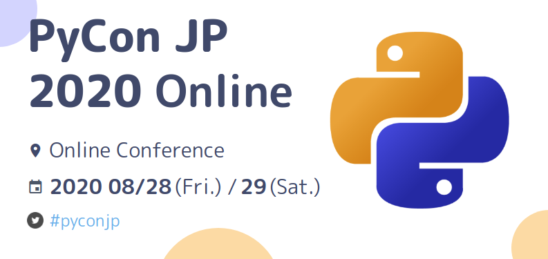

## 最先端自然言語処理ライブラリの最適な選択と有用な利用方法

- 発表スケジュール: 2020/08/29 14:50-15:20 (30min)
- 発表詳細: https://pycon.jp/2020/timetable/?id=203164
- 発表スライド（Speaker Deck）: https://speakerdeck.com/taishii/pycon-jp-2020
- サンプルコード（Google Colab）: https://colab.research.google.com/drive/1Zu8iQO3GNj48btKipy-J1jjgSGchwD5P?usp=sharing
- サンプルコード（Jupyter Notebook）: https://github.com/taishi-i/toiro/blob/develop/PyConJP2020/PyConJP2020_Online.ipynb

## エレベーターピッチ

ここ数年、日本語を解析対象とする自然言語処理ライブラリが多く公開されています。
BERTを手軽に利用できるTransformersなど、最先端の言語処理技術を利用できるライブラリの多くは、Pythonライブラリとして提供されています。
しかし、多くのライブラリがリリースされる反面、ユーザー側の選択肢は増え、情報収集を含む技術選定コストが増加していることも事実です。
そこで、本トークでは、日本語を解析対象とするPythonライブラリを整理し、利用シーンごとにライブラリを最適に選択する方法を説明します。
日本語の文書分類タスクを通じて、コードの実装方法を説明し、各ライブラリの特徴や利点を解説します。
